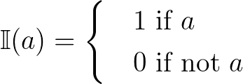

# Linear Support Vector Machine for MNIST dataset

The MNIST database (Modified National Institute of Standards and Technology 
database) is a large database of handwritten digits that is commonly used for 
training various image processing systems and is commonly used in machine 
learning.

The images are 28x28 pixels in size and with the numbers scaled to fit a 
bounding box of 20x20, grayscaled and antialiased. The creators of the set
LeCun et al managed to acheive a 0.8 error rate with a nonlinear SVM in 
their 1998 paper 
[_Gradient-Based Learning Applied to Document Recognition_](
http://yann.lecun.com/exdb/publis/pdf/lecun-98.pdf). In this exercise you
should be able to acheive an error rate of around 7.0 with a linear SVM.

The data is provided in a gzipped Python serialized "pickle" file mnist.pkl.gz.
The code for extracting the data, calling methods and creating visualisations
has been written for you. Your task is to complete the methods in the 
SupportVectorMachine class and tune the hyperparameters.

## Completing the Support Vector Machine Class

There are a number of methods in the `SupportVectorMachine` class in svm.py
for your to complete.

### `predict`

Start with the predict method. This should be pretty straightforward.
Remember to take the argmax of the result to get the label

### `compute_loss`

#### Hinge Loss

Implement computing the SVM 'Hinge Loss' as described by this formula:

Where:

`y_i`  = correct label

`s_j`  = incorrect class score

`s_yi` = correct class score

When you initialize your weights matrix W, the weights will be very small your
loss should start at ~ 9 (i.e. number of classes - 1). This is a good 
_sanity check_ to ensure you've implemented it correctly.

It can be tricky to get the vectorized maths correct first time so perhaps try
implementing it with for-loops at first and get it working first and then remove 
them when you're confident your maths is correct.

For regularisation R, start with weight decay but feel free to experiment with
other regularisation functions.

#### Gradient

Compute loss should also return the gradient of the loss function. The equations
for the loss per datapoint are as follows:

This is equivalent to: `number of classes that contributed to the loss * -x_i`

Remember:

You'll need to determine and implement the total loss yourself.

### `train`

You need to implement the Weight-update using Stochastic Gradient Descent. 
The only trick here is to make sure you take a Gaussian sample of the data for your
minibatch. See `numpy.random.choice`.

Make sure you append the computed loss of each iteration to the list `loss_history`
as this is returned at the end. If you don't the visualization won't work!

## Training your Classifier

### Hyperparameters

Once you've completed your class, the next step is to tune your hyperparameters the
file `mnist.py`. Do this by training the classifier many times and checking the 
accuracy against the validation set.

Running the file `mnist.py` will load the training data for you. You may wish to use
the skeleton function `train_hyperparamters`, but this is up to you.

### Training and Classifying

Once you've set your hyperparameters, set the `hyperparameters_tuned` flag to `True`
and tune your model.

When the training is done, you should see a graph showing the exponential decrease in
loss. Press any key to continue.

You'll then be shown a visualization of your weights. Depending on how you set your
hyperparameters they may look vaguely like numbers or like not much at all.
Press any key to continue.

You'll get your training and test accuracy printed out to the console. You should be
able to get a test accuracy of just under 0.93

## Going further

If we wish to improve the quality of our model, we need to increase its capactiy. 
Two options we could try for doing this:

* Use a Kernel Trick: We can model the nonlinearities of the data by running the
data through a Kernel. Try using the gaussian kernel?

* Extract features: Instead of using the pixels directly as dimensions of data,
we may be able to get better results by extracting features first and training our
SVM on them. Histogram of Oriented Gradients (HOG) is popular choice for such purposes.
